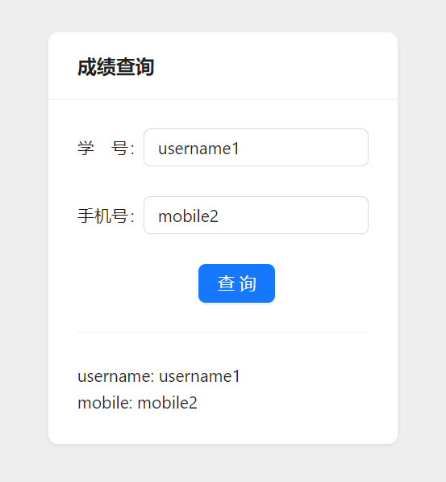

# simple_query
A simple React form request example, and a simple golang server



The file `lws.config.js` is the configuration parameter required to run local-web-server, including starting a static server and rewriting the request to the server

```
# Install local-web-server
cd simple_query
npm install -g local-web-server

# Build static web page
yarn build

# Build the server
cd go_server
go buid
cd ..

# Start the server
go_server/server&

# Start the local static web server, rewrite requests
ws
```

Demo: http://localhost:8081 